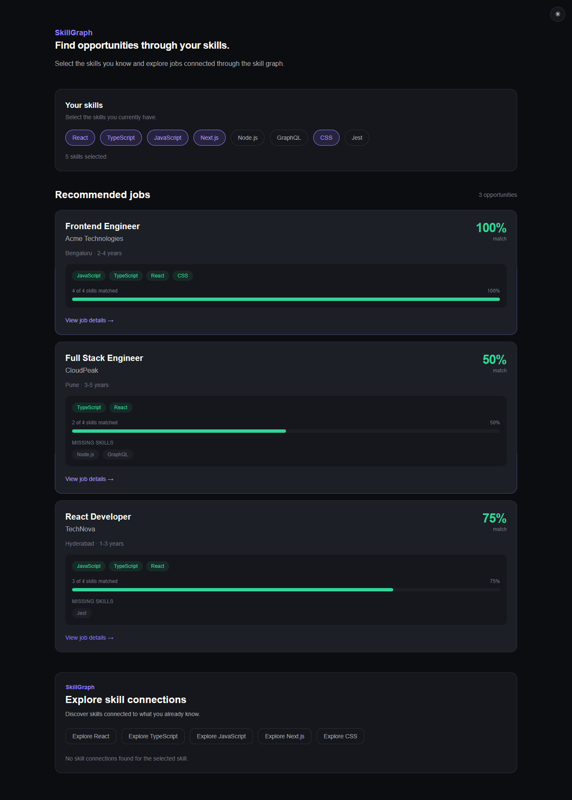
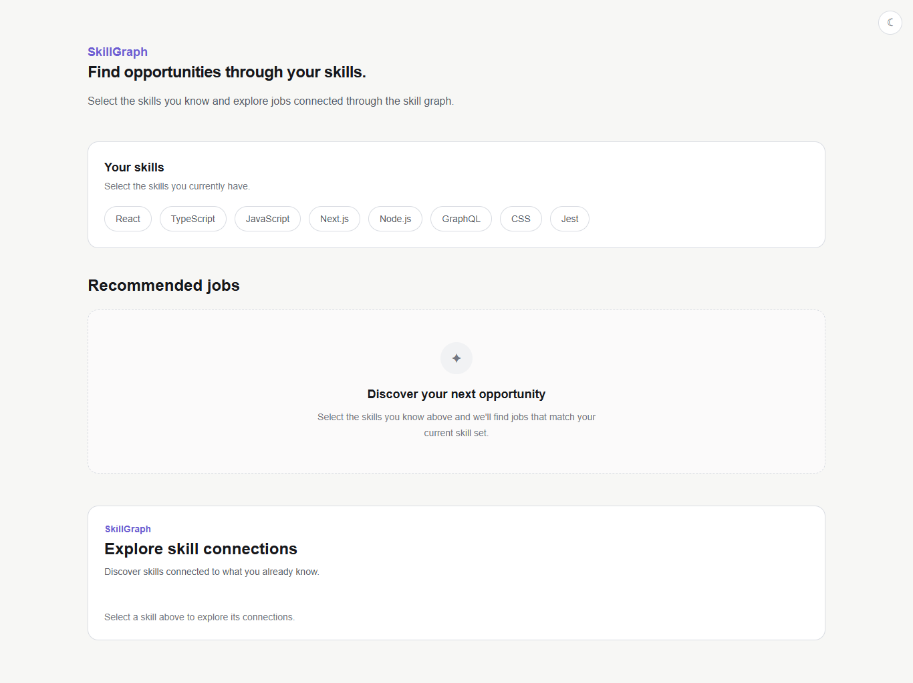
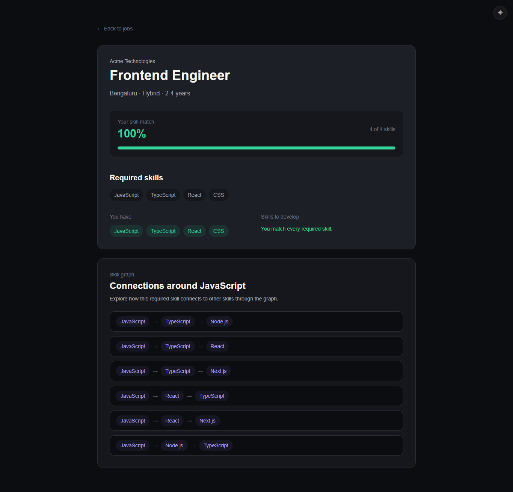
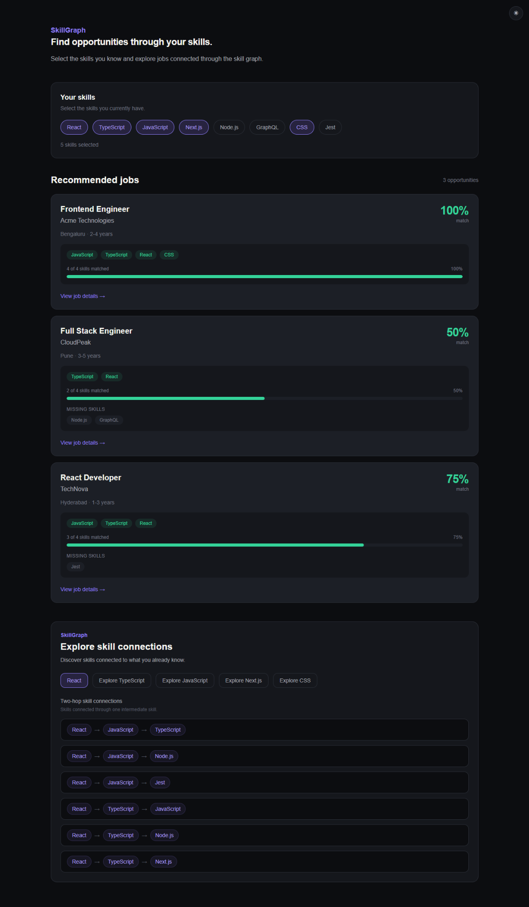

# Wexa AI Assessment

SkillGraph is a graph-powered job discovery application built for the Wexa AI assessment.

Users select the skills they currently have and discover relevant job opportunities, see how their skills match each role, identify missing skills, and explore related skills through the graph database.

## Live Demo

Try the deployed application:

**https://wexa-ai-assessment-six.vercel.app/**

## Demo Video

A short walkthrough of the application covering skill selection, automatic job matching, job details, navigation state preservation, skill graph exploration, and theme switching.

**[Watch the demo](https://drive.google.com/file/d/1-553_jxLh6wNxxWjjmsm_ifIsqp-4TaT/view?usp=sharing)**

## Screenshots

### Homepage — Dark Mode



### Homepage — Light Mode



### Job Details



### Skill Graph



---

## Features

- Select and deselect multiple skills.
- Automatically fetch matching jobs when selected skills change.
- View match percentage, matched skills, and missing skills for each job.
- Open a dedicated job details page.
- Preserve selected skills and job results when navigating back from job details.
- Preserve skill selection through browser Back navigation and page refreshes.
- Explore two-hop relationships between skills.
- Highlight the skill currently being explored in the skill graph.
- Clear stale skill-graph results when selected skills are cleared.
- Responsive UI.
- Dark and light themes.
- Persist theme preference across reloads.
- Follow the system color-scheme preference when no saved preference exists.
- Centralized application constants, shared types, and semantic design tokens.

---

## Tech Stack

- **Next.js 16**
- **React 19**
- **TypeScript**
- **Tailwind CSS 4**
- **CognoDB**
- **Neo4j JavaScript Driver**
- **Cypher**
- **ESLint**

---

## Project Structure

```text
.
├── app/
│   ├── api/
│   │   ├── graph/
│   │   │   └── route.ts
│   │   └── jobs/
│   │       ├── route.ts
│   │       └── [id]/
│   │           └── route.ts
│   ├── jobs/
│   │   └── [id]/
│   │       └── page.tsx
│   ├── globals.css
│   ├── layout.tsx
│   └── page.tsx
├── components/
│   ├── JobCard.tsx
│   ├── SkillGraph.tsx
│   ├── SkillSelector.tsx
│   └── ThemeToggle.tsx
├── constants/
│   ├── config.ts
│   └── skills.ts
├── lib/
│   └── db.ts
├── scripts/
│   └── seed.ts
├── types/
│   └── job.ts
├── .env.example
├── package.json
├── package-lock.json
└── README.md
```

---

## Getting Started

### Prerequisites

- Node.js
- npm
- A CognoDB instance

### 1. Install dependencies

```bash
npm install
```

### 2. Create a CognoDB instance

Create a free CognoDB `c0` instance from the CognoDB console.

After creating the instance, keep the connection details available for the application configuration.

### 3. Configure environment variables

Create `.env.local` in the project root:

```env
COGNODB_URI=your_cognodb_uri
COGNODB_USER=your_cognodb_user
COGNODB_PASSWORD=your_cognodb_password
```

Never commit `.env.local` or real database credentials.

### 4. Seed the database

The repository includes a seed script for the sample companies, jobs, skills, and relationships:

```bash
npm run seed
```

### 5. Start the development server

```bash
npm run dev
```

Open `http://localhost:3000`.

---

## How It Works

### Skill Selection and Job Matching

Users select the skills they currently have. Each selection change automatically requests matching jobs:

```text
GET /api/jobs?skills=React,TypeScript
```

The API retrieves jobs and their required skills from CognoDB. It then determines which required skills overlap with the user's selected skills.

For each job:

```text
match percentage =
matched skills / total required skills × 100
```

For example:

```text
Required:
React
TypeScript
JavaScript
CSS

User skills:
React
TypeScript

Match:
2 / 4 × 100 = 50%
```

The response also includes matched and missing skills.

The match percentage represents direct skill overlap; it is not an AI prediction.

### Job Details

Selecting a job opens:

```text
/jobs/[id]
```

The job details page retrieves the individual job through:

```text
GET /api/jobs/[id]
```

Selected skills are carried through the URL so the user's context can be restored when returning to the job list.

### Skill Graph

Users can explore connections for any selected skill:

```text
GET /api/graph?skill=React
```

The graph API performs a two-hop traversal using `RELATED_TO` relationships and returns paths such as:

```text
React → JavaScript → TypeScript
```

The graph component keeps its loading state and fetched paths local to the component. When all selected skills are cleared, stale graph results are hidden and the empty state is restored.

---

## API Endpoints

### `GET /api/jobs`

Returns jobs matching at least one selected skill.

Example:

```text
/api/jobs?skills=React,TypeScript
```

### `GET /api/jobs/[id]`

Returns details for a specific job.

Example:

```text
/api/jobs/19
```

### `GET /api/graph`

Returns two-hop skill connections for a selected skill.

Example:

```text
/api/graph?skill=React
```

Example response:

```json
{
  "skill": "React",
  "paths": [
    ["React", "JavaScript", "TypeScript"],
    ["React", "JavaScript", "Node.js"],
    ["React", "TypeScript", "Next.js"]
  ]
}
```

---

## Graph Data Model

The application uses a graph-oriented model:

```text
Company
   │
   │ POSTED
   ▼
  Job
   │
   │ REQUIRES
   ▼
 Skill
   │
   │ RELATED_TO
   ▼
 Skill
```

### Nodes

**Company**

- `name`

**Job**

- `title`
- `location`
- `workMode`
- `experience`

**Skill**

- `name`

### Relationships

```text
Company -[:POSTED]-> Job
Job -[:REQUIRES]-> Skill
Skill -[:RELATED_TO]-> Skill
```

This structure supports both job matching and multi-hop skill exploration.

---

## Why a Graph Database?

The core questions in SkillGraph are about relationships rather than isolated records:

- Which jobs are connected to the skills a candidate already has?
- Which skills are related to a candidate's existing skills?
- What other skills can be reached through those relationships?

The data naturally forms a graph:

```text
Company → Job → Skill → Related Skill
```

A relational database could represent the same information using separate tables and joins. However, exploring relationships across multiple skills would require increasingly complex joins or recursive queries.

With a graph database, these relationships are first-class data. For example, a two-hop traversal such as:

```text
React → TypeScript → Next.js
```

can be queried directly through connected skill nodes.

This makes CognoDB a natural fit for SkillGraph because the value of the application comes from understanding connections between jobs and skills, rather than simply retrieving independent rows.

---

## Architecture

```text
┌───────────────────────────────┐
│           Next.js UI          │
│                               │
│  Skill Selection              │
│  Job Recommendations          │
│  Job Details                  │
│  Skill Graph                  │
└───────────────┬───────────────┘
                │
                │ HTTP
                ▼
┌───────────────────────────────┐
│       Next.js API Routes      │
│                               │
│  /api/jobs                    │
│  /api/jobs/[id]               │
│  /api/graph                   │
└───────────────┬───────────────┘
                │
                │ Neo4j Driver
                ▼
┌───────────────────────────────┐
│           CognoDB             │
│                               │
│  Company → Job → Skill        │
│                  ↓            │
│             Related Skill     │
└───────────────────────────────┘
```

Parameterized Cypher queries are used so user-provided values are passed separately from query structure.

---

## Component Architecture

The UI is split into focused components.

### `SkillSelector`

Displays available skills and handles skill selection through props.

### `JobCard`

Displays job information, match analysis, matched skills, missing skills, and navigation to job details.

### `SkillGraph`

Handles graph exploration, graph-specific loading state, fetched paths, and the active explored skill.

### `ThemeToggle`

Handles dark/light theme switching and persistence.

---

## Shared Types and Constants

### Shared Types

`types/job.ts` contains the shared domain types:

- `Job`
- `JobDetail`
- `SkillGraphPath`
- `SkillGraphResponse`

Keeping these definitions in one place avoids duplicate API and UI types.

### Constants

Reusable configuration is centralized under `constants/`:

- `constants/skills.ts` — available skills
- `constants/config.ts` — shared API route/configuration values

---

## Styling and Theming

The application uses Tailwind CSS with centralized semantic design tokens defined in `app/globals.css`.

Components use semantic utilities such as:

- `bg-background`
- `bg-surface`
- `bg-surface-secondary`
- `border-border`
- `text-primary`
- `text-success`
- `text-foreground`

The visual system uses:

- charcoal surfaces for structure
- indigo/purple for interaction
- green for successful matches
- neutral tones for supporting and missing information

### Dark Mode

Dark mode is the default theme.

### Light Mode

Users can switch to light mode with the theme toggle. The preference is persisted using `localStorage`.

When no saved preference exists, the application follows the user's system color-scheme preference.

---

## Design Decisions

### Why use URL state instead of global state?

Selected skills are part of the current page context and need to survive navigation.

Using the URL provides:

- navigation persistence
- browser Back support
- refresh persistence
- shareable state
- no additional state-management dependency

For this application's scope, a global state library would add unnecessary complexity.

### Why calculate matching data in the API?

The API already retrieves required skills and determines their overlap with the selected skills.

Calculating the match percentage and missing skills there keeps the job response consistent and lets the frontend focus on presentation.

### Why use shared types?

The API routes and UI consume the same domain models. Keeping these types in one place reduces duplication and makes future data-shape changes easier to maintain.

### Why use centralized design tokens?

Semantic design tokens allow the visual system to be changed in one place. For example, changing the primary accent does not require searching through every component for individual color values.

---

## Validation

The project has been validated with:

```bash
npm run lint
```

and:

```bash
npm run build
```

Both complete successfully.

The main application flows were also browser-tested, including:

- skill selection and automatic job fetching
- clearing selected skills
- job details navigation
- browser Back navigation
- skill and job-result restoration
- skill graph exploration
- active explored-skill highlighting
- clearing stale graph results
- dark/light theme switching
- theme persistence
- system theme preference
- hydration behavior

No console or page errors were observed during the verified flows.

---

## Future Improvements

The current implementation intentionally keeps the scope focused on the core skill-matching experience.

Potential future improvements include:

- job search and filtering
- pagination or infinite scrolling for larger datasets
- a visual graph/network representation
- more advanced job-ranking algorithms
- richer skill and job metadata
- server-side caching for frequently requested queries
- personalized user profiles and saved opportunities

These were kept out of the current implementation to keep the assessment focused and avoid unnecessary complexity.

---

## Scripts

### `npm run dev`

Starts the development server.

### `npm run build`

Creates a production build.

### `npm run start`

Starts the production server after a successful build.

### `npm run lint`

Runs ESLint.

### `npm run seed`

Seeds the graph database using the project's seed script.

---

## License

Built as part of the Wexa AI assessment.
